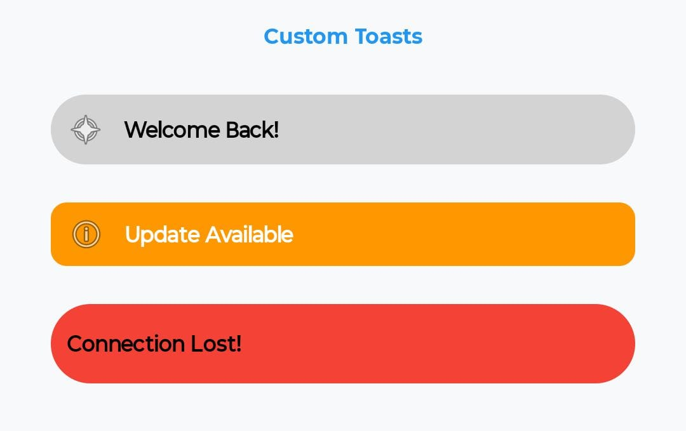
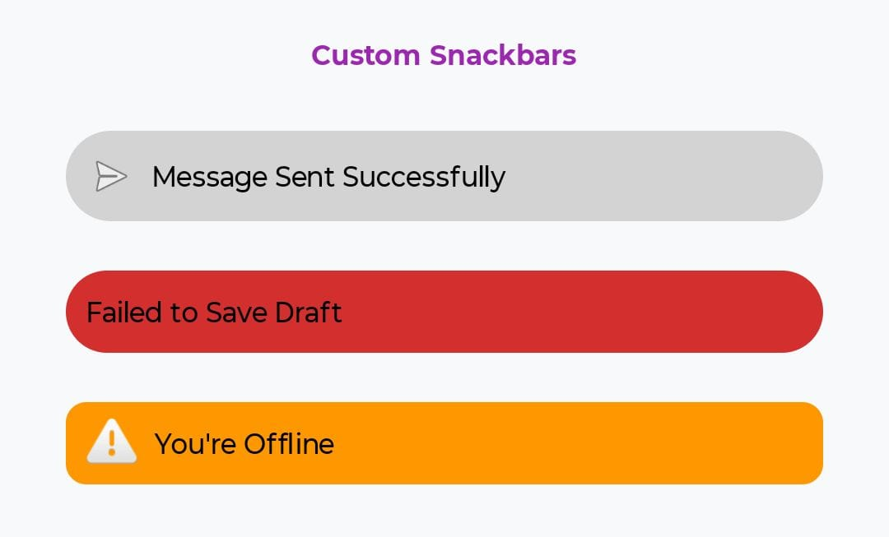
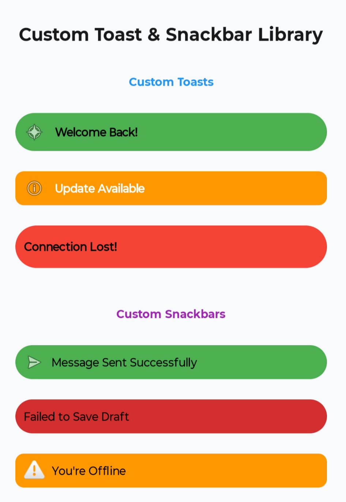
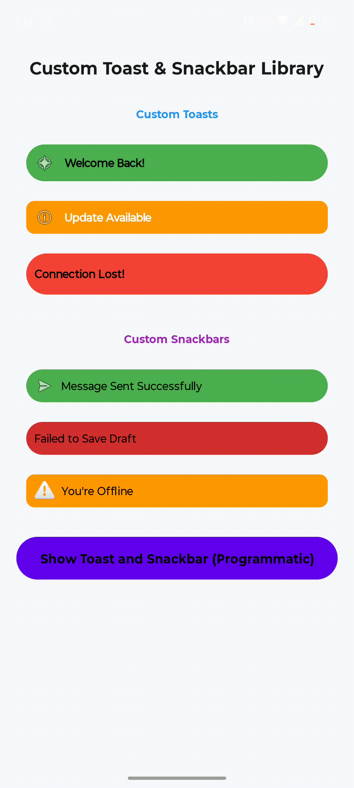

# Custom Toast & Snackbar Library

[](https://kotlinlang.org/)
[](LICENSE)
[](#)

**Custom Toast & Snackbar Library** is an Android library that provides highly customizable Toast and Snackbar components. Easily change icons, colors, paddings, margins, corner radius, and background tints through XML attributes or programmatically at runtime.

---

## 📸 Preview

| Custom Toast | Custom Snackbar | Mixed Examples |
|--------------|-----------------|----------------|
|  |  |  |

### 🎥 Demo Video



---

## ✨ Features

- **Custom Icons**: Use any drawable for Toast and Snackbar
- **Flexible Styling**: Control paddings, margins, icon spacing, and background colors
- **Runtime Customization**: Change appearance programmatically at any time
- **Material Design Compatible**: Works seamlessly with Material Design components
- **Easy Integration**: Simple XML attributes for quick customization
- **Auto-Show**: Automatically display when view is attached (optional)
- **Multiple Durations**: Support for SHORT, LONG, and INDEFINITE durations
- **Lightweight**: Minimal overhead, uses native Android components

---

## 📦 Installation

**Step 1:** Add JitPack repository to your root `build.gradle`:

```gradle
allprojects {
    repositories {
        maven { url 'https://jitpack.io' }
    }
}
```

**Step 2:** Add dependency to your app module's `build.gradle`:

```gradle
dependencies {
	        implementation("com.github.Excelsior-Technologies-Community:CustomToastSnackbar:1.0.0")
}
```

---

## 🚀 Usage

### CustomToast - XML

```xml
<!-- Default Toast -->
<com.ext.custom_toast_snackbar.CustomToast
    android:layout_width="match_parent"
    android:layout_height="wrap_content"
    android:layout_margin="12dp"
    app:toastText="Welcome Back!"
    app:toastTextColor="@color/black" />

<!-- Toast with Icon and Custom Background -->
<com.ext.custom_toast_snackbar.CustomToast
    android:layout_width="match_parent"
    android:layout_height="wrap_content"
    android:layout_margin="12dp"
    app:toastIcon="@android:drawable/ic_menu_compass"
    app:toastIconSize="24dp"
    app:toastText="Data Synced Successfully!"
    app:toastTextColor="@android:color/white"
    app:toastBackgroundColor="#2196F3"
    app:toastCornerRadius="10dp"
    app:toastDuration="durationLong"
    app:toastPaddingStart="16dp"
    app:toastPaddingEnd="16dp"
    app:toastPaddingTop="12dp"
    app:toastPaddingBottom="12dp" />

<!-- Rounded Toast with Warning Style -->
<com.ext.custom_toast_snackbar.CustomToast
    android:layout_width="match_parent"
    android:layout_height="wrap_content"
    android:layout_margin="12dp"
    app:toastIcon="@android:drawable/ic_dialog_alert"
    app:toastIconSize="20dp"
    app:toastText="Connection Lost!"
    app:toastTextColor="@android:color/white"
    app:toastBackgroundColor="#F44336"
    app:toastCornerRadius="32dp"
    app:toastIconPadding="12dp"
    app:toastDuration="durationLong" />
```

### CustomSnackbar - XML

```xml
<!-- Default Snackbar -->
<com.ext.custom_toast_snackbar.CustomSnackbar
    android:layout_width="match_parent"
    android:layout_height="wrap_content"
    android:layout_margin="12dp"
    app:snackbarText="Message Sent Successfully"
    app:snackbarTextColor="@color/black" />

<!-- Snackbar with Icon and Custom Styling -->
<com.ext.custom_toast_snackbar.CustomSnackbar
    android:layout_width="match_parent"
    android:layout_height="wrap_content"
    android:layout_margin="12dp"
    app:snackbarIcon="@android:drawable/ic_menu_send"
    app:snackbarIconSize="24dp"
    app:snackbarText="Sync Complete • 5 Items"
    app:snackbarTextColor="@android:color/black"
    app:snackbarBackgroundColor="#8BC34A"
    app:snackbarCornerRadius="20dp"
    app:snackbarDuration="durationLong"
    app:snackbarMarginStart="16dp"
    app:snackbarMarginEnd="16dp"
    app:snackbarMarginBottom="120dp" />

<!-- Indefinite Snackbar with Warning -->
<com.ext.custom_toast_snackbar.CustomSnackbar
    android:layout_width="match_parent"
    android:layout_height="wrap_content"
    android:layout_margin="12dp"
    app:snackbarIcon="@android:drawable/ic_dialog_alert"
    app:snackbarIconSize="20dp"
    app:snackbarText="You're Offline"
    app:snackbarTextColor="@android:color/white"
    app:snackbarBackgroundColor="#FF9800"
    app:snackbarCornerRadius="4dp"
    app:snackbarDuration="durationIndefinite"
    app:snackbarIconPadding="8dp" />
```

---

## 💻 Kotlin Programmatic Usage

### CustomToast

```kotlin
// Basic Toast
CustomToast(this)
    .setText("Data synced successfully!")
    .setTextColor(Color.BLACK)
    .show()

// Customized Toast with Icon
CustomToast(this)
    .setText("Upload Complete!")
    .setIcon(ContextCompat.getDrawable(this, android.R.drawable.ic_menu_upload))
    .setIconSize(40f)
    .setToastBackgroundColor(Color.parseColor("#2196F3"))
    .setTextColor(Color.WHITE)
    .setCornerRadius(30f)
    .setDuration(Toast.LENGTH_LONG)
    .setCustomMargins(20, 10, 20, 10)
    .show()

// Advanced Toast with Full Customization
CustomToast(this)
    .setText("Warning: Low Battery")
    .setIcon(ContextCompat.getDrawable(this, android.R.drawable.ic_dialog_alert))
    .setIconSize(32f)
    .setToastBackgroundColor(Color.parseColor("#FF5722"))
    .setTextColor(Color.WHITE)
    .setCornerRadius(16f)
    .setCustomPaddings(24, 16, 24, 16)
    .setCustomMargins(16, 8, 16, 8)
    .setDuration(Toast.LENGTH_LONG)
    .setAutoShow(true)
    .show()
```

### CustomSnackbar

```kotlin
// Basic Snackbar
CustomSnackbar(this)
    .setParentView(binding.root)
    .setText("Action completed successfully")
    .show()

// Customized Snackbar with Icon
CustomSnackbar(this)
    .setParentView(binding.root)
    .setText("Sync complete • 5 items")
    .setIcon(ContextCompat.getDrawable(this, android.R.drawable.ic_menu_save))
    .setIconSize(40f)
    .setSnackbarBackgroundColor(Color.parseColor("#8BC34A"))
    .setTextColor(Color.BLACK)
    .setCornerRadius(32f)
    .setCustomMargins(44, 0, 44, 140)
    .setDuration(Snackbar.LENGTH_LONG)
    .show()

// Advanced Snackbar with Full Customization
CustomSnackbar(this)
    .setParentView(findViewById(android.R.id.content))
    .setText("Connection restored")
    .setIcon(ContextCompat.getDrawable(this, android.R.drawable.ic_menu_info_details))
    .setIconSize(28f)
    .setIconPadding(12)
    .setSnackbarBackgroundColor(Color.parseColor("#4CAF50"))
    .setTextColor(Color.WHITE)
    .setCornerRadius(24f)
    .setCustomPaddings(20, 12, 20, 12)
    .setCustomMargins(24, 8, 24, 80)
    .setDuration(Snackbar.LENGTH_INDEFINITE)
    .setAutoShow(true)
    .show()

// Dismiss Snackbar
snackbar.dismiss()
```

---

## 🔧 XML Attributes

### CustomToast Attributes

| Attribute | Type | Default | Description |
|-----------|------|---------|-------------|
| toastText | string | "Custom Toast" | Toast message text |
| toastTextColor | color | Color.WHITE | Text color |
| toastIcon | reference | null | Drawable icon |
| toastIconSize | dimension | 24dp | Icon size |
| toastIconPadding | dimension | 12dp | Space between icon and text |
| toastBackgroundColor | color | #D3D3D3 | Background color |
| toastCornerRadius | dimension | 16dp | Corner radius |
| toastPaddingStart | dimension | 10dp | Left/Start padding |
| toastPaddingEnd | dimension | 10dp | Right/End padding |
| toastPaddingTop | dimension | 10dp | Top padding |
| toastPaddingBottom | dimension | 10dp | Bottom padding |
| toastMarginStart | dimension | 0dp | Left/Start margin |
| toastMarginEnd | dimension | 0dp | Right/End margin |
| toastMarginTop | dimension | 0dp | Top margin |
| toastMarginBottom | dimension | 40dp | Bottom margin |
| toastDuration | enum | durationShort | Duration (durationShort, durationLong) |

### CustomSnackbar Attributes

| Attribute | Type | Default | Description |
|-----------|------|---------|-------------|
| snackbarText | string | "Snackbar" | Snackbar message text |
| snackbarTextColor | color | Color.WHITE | Text color |
| snackbarIcon | reference | null | Drawable icon |
| snackbarIconSize | dimension | 24dp | Icon size |
| snackbarIconPadding | dimension | 8dp | Space between icon and text |
| snackbarBackgroundColor | color | #D3D3D3 | Background color |
| snackbarCornerRadius | dimension | 12dp | Corner radius |
| snackbarPaddingStart | dimension | 10dp | Left/Start padding |
| snackbarPaddingEnd | dimension | 10dp | Right/End padding |
| snackbarPaddingTop | dimension | 10dp | Top padding |
| snackbarPaddingBottom | dimension | 10dp | Bottom padding |
| snackbarMarginStart | dimension | 0dp | Left/Start margin |
| snackbarMarginEnd | dimension | 0dp | Right/End margin |
| snackbarMarginTop | dimension | 0dp | Top margin |
| snackbarMarginBottom | dimension | 8dp | Bottom margin |
| snackbarDuration | enum | durationShort | Duration (durationShort, durationLong, durationIndefinite) |

---

## 📝 Methods

### CustomToast Methods

```kotlin
fun setText(text: String)                        // Set toast text
fun setTextColor(color: Int)                     // Set text color
fun setIcon(icon: Drawable?)                     // Set icon drawable
fun setIconSize(sizeDp: Float)                   // Set icon size in dp
fun setToastBackgroundColor(color: Int)          // Set background color
fun setCornerRadius(radiusDp: Float)             // Set corner radius
fun setCustomPaddings(start: Int, top: Int, end: Int, bottom: Int)  // Set paddings
fun setCustomMargins(start: Int, top: Int, end: Int, bottom: Int)   // Set margins
fun setDuration(duration: Int)                   // Set duration (Toast.LENGTH_SHORT/LONG)
fun setAutoShow(show: Boolean)                   // Enable/disable auto-show
fun show()                                       // Display the toast
```

### CustomSnackbar Methods

```kotlin
fun setParentView(view: View)                    // Set parent view for snackbar
fun setText(text: String)                        // Set snackbar text
fun setTextColor(color: Int)                     // Set text color
fun setIcon(icon: Drawable?)                     // Set icon drawable
fun setIconSize(sizeDp: Float)                   // Set icon size in dp
fun setIconPadding(dp: Int)                      // Set icon padding
fun setSnackbarBackgroundColor(color: Int)       // Set background color
fun setCornerRadius(radiusDp: Float)             // Set corner radius
fun setCustomPaddings(start: Int, top: Int, end: Int, bottom: Int)  // Set paddings
fun setCustomMargins(start: Int, top: Int, end: Int, bottom: Int)   // Set margins
fun setDuration(duration: Int)                   // Set duration (Snackbar.LENGTH_*)
fun setAutoShow(show: Boolean)                   // Enable/disable auto-show
fun show()                                       // Display the snackbar
fun dismiss()                                    // Dismiss the snackbar
```

---

## 📄 License

```
MIT License

Copyright (c) 2025 Excelsior Technologies 

Permission is hereby granted, free of charge, to any person obtaining a copy
of this software and associated documentation files (the "Software"), to deal
in the Software without restriction, including without limitation the rights
to use, copy, modify, merge, publish, distribute, sublicense, and/or sell
copies of the Software, and to permit persons to whom the Software is
furnished to do so, subject to the following conditions:

The above copyright notice and this permission notice shall be included in all
copies or substantial portions of the Software.

THE SOFTWARE IS PROVIDED "AS IS", WITHOUT WARRANTY OF ANY KIND, EXPRESS OR
IMPLIED, INCLUDING BUT NOT LIMITED TO THE WARRANTIES OF MERCHANTABILITY,
FITNESS FOR A PARTICULAR PURPOSE AND NONINFRINGEMENT. IN NO EVENT SHALL THE
AUTHORS OR COPYRIGHT HOLDERS BE LIABLE FOR ANY CLAIM, DAMAGES OR OTHER
LIABILITY, WHETHER IN AN ACTION OF CONTRACT, TORT OR OTHERWISE, ARISING FROM,
OUT OF OR IN CONNECTION WITH THE SOFTWARE OR THE USE OR OTHER DEALINGS IN THE
SOFTWARE.
```

---
